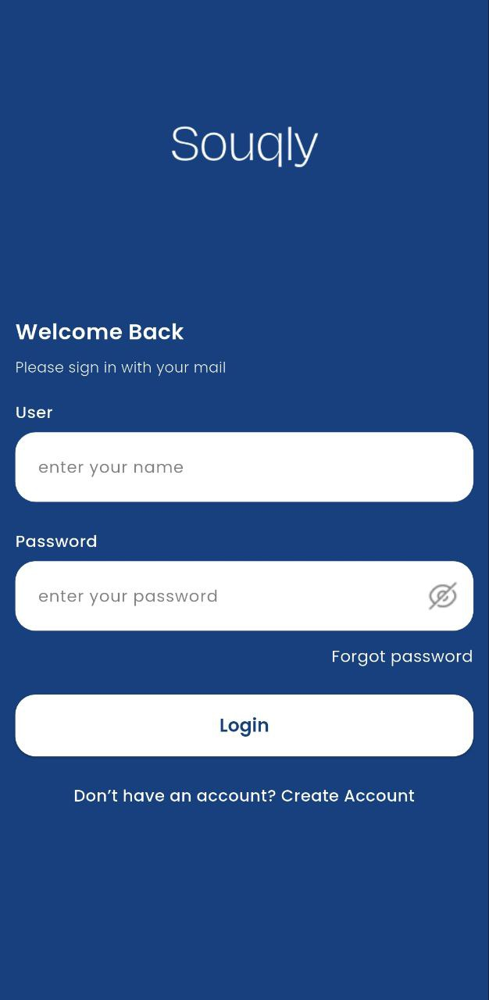
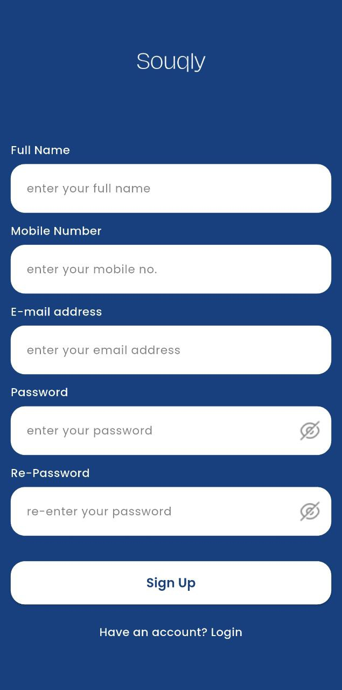
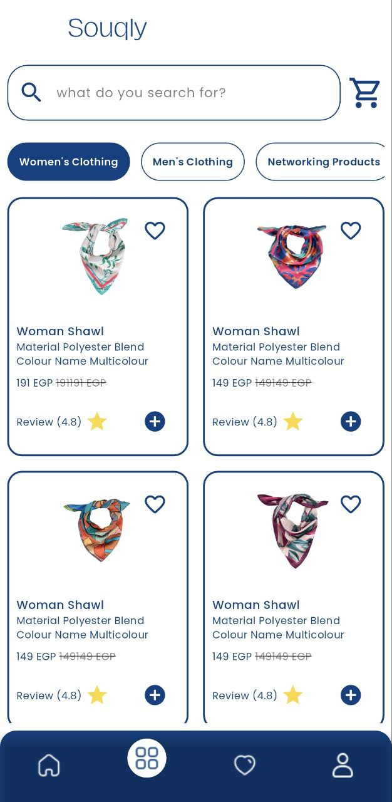
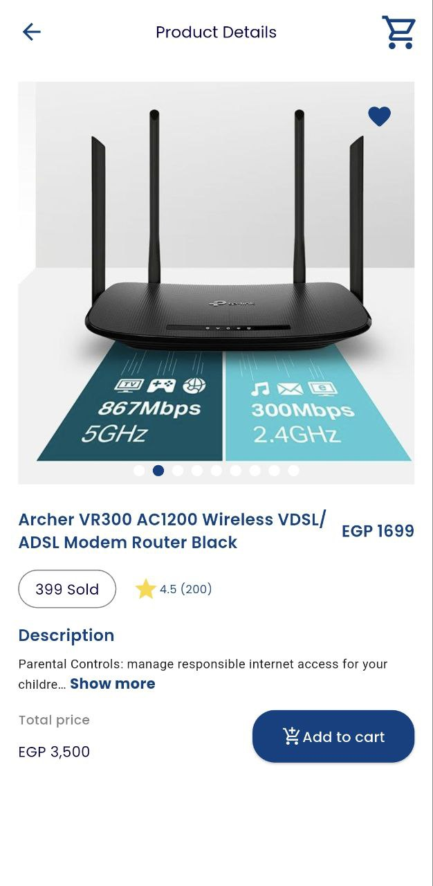
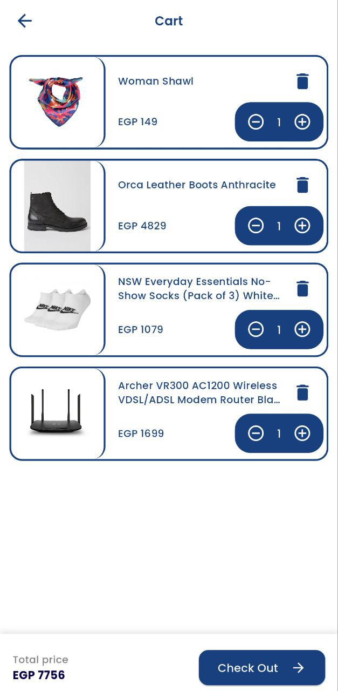
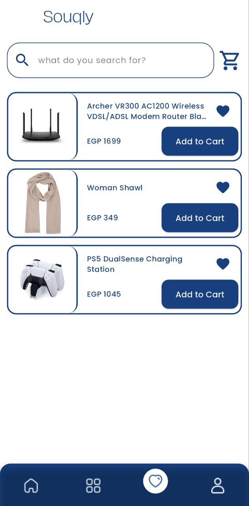
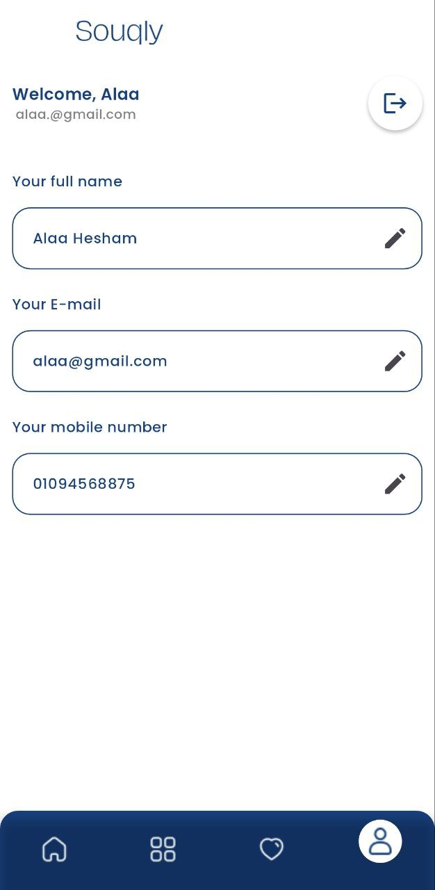

# 🛍️ Souqly  

  
*A modern e-commerce app built with Flutter, featuring authentication, cart, wishlist, and real-time product updates.*  

---

## 📸 Screenshots  
> Showcase of Souqly in action  


### Authentication & Home
| Splash | Login | Signup | Home |
|--------|-------|--------|------|
|  |  |  |  |

### Products & Cart
| Products | Product Details | Cart |
|----------|-----------------|------|
|  |  |  |

### Wishlist & Profile
| Wishlist | Profile |
|----------|---------|
|  |  |

---

## ✨ Features  
- 🔐 **Authentication** (API-based login & signup)  
- 🛒 **Cart management** with product add/remove  
- ❤️ **Wishlist** to save favorite items  
- 🔎 **Product browsing** with filtering by subcategory  
- 📱 **Responsive UI** powered by `flutter_screenutil`  
- ⚡ **Modern clean architecture** using Cubit & dependency injection  

---

## 🛠️ Tech Stack  

### Frameworks & Architecture
- [Flutter](https://flutter.dev/)  
- Clean Architecture  
- Cubit (from `flutter_bloc`)  
- Dependency Injection (`get_it` + `injectable`)  

### Networking & Utils
- [Dio](https://pub.dev/packages/dio) – HTTP client  
- [Dartz](https://pub.dev/packages/dartz) – Functional programming (Either, Option)  
- [connectivity_plus](https://pub.dev/packages/connectivity_plus) – Network status  

### UI/UX & Design
- [flutter_screenutil](https://pub.dev/packages/flutter_screenutil) – Responsive design  
- [google_fonts](https://pub.dev/packages/google_fonts) – Custom typography  
- [cached_network_image](https://pub.dev/packages/cached_network_image) – Image caching  
- [badges](https://pub.dev/packages/badges) – Cart & wishlist indicators  
- [flutter_image_slideshow](https://pub.dev/packages/flutter_image_slideshow) – Banners & promos  
- [another_flushbar](https://pub.dev/packages/another_flushbar) – Notifications & messages  

### Storage & State
- [shared_preferences](https://pub.dev/packages/shared_preferences) – Local storage  
- [flutter_bloc](https://pub.dev/packages/flutter_bloc) – State management with Cubit  

### Dev Tools
- [injectable_generator](https://pub.dev/packages/injectable_generator)  
- [build_runner](https://pub.dev/packages/build_runner)  

---

## 📐 Architecture  

Souqly is built with **Clean Architecture**:  
- **Presentation layer:** Flutter UI + Cubit for state management  
- **Domain layer:** Use cases & entities  
- **Data layer:** Repositories & API services  
- **Dependency Injection:** via `get_it` and `injectable`  

This ensures **testability, scalability, and maintainability**.  

---

## 🚀 Getting Started  

### Prerequisites
- [Flutter SDK](https://flutter.dev/docs/get-started/install)  
- API backend running (replace base URL in `dio` config)  

### Installation
```bash
# Clone repo
git clone https://github.com/your-username/souqly.git

# Navigate into project
cd souqly

# Get dependencies
flutter pub get

# Run the app
flutter run

```

---


